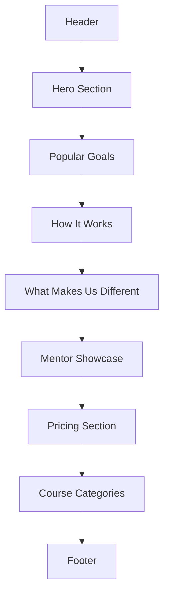

# 🌐 Pathwise — Landing Page Implementation Checklist (MVP Phase 1)
---

## SECTION 1: Initial Setup

---

* [x] Set up layout structure using the existing `Layout` or `AppShell` component
* [x] Integrate shadcn UI (if not already set up)
* [x] Install and configure:

  * [x] `lucide-react` for icons
  * [x] `@tailwindcss/aspect-ratio` for responsive images (using Radix UI AspectRatio component)
  * [x] Fonts (`Inter`) and base typography utilities
* [x] Configure metadata using `next/head` (`title`, `description`, OG tags)

---

## SECTION 2: Header / Navigation

---

* [x] Create a `Header` component

  * [x] **Left:** Logo (Text: "Pathwise")
  * [x] **Center:** Navigation links: `How It Works`, `Learning Paths`, `Mentors`, `Pricing`
  * [x] **Right:** `Sign Up` button using `Button` from shadcn UI
* [x] Make header `sticky` with top shadow on scroll
* [x] Add mobile responsiveness: hamburger menu + mobile nav drawer

---

## SECTION 3: Hero Section

---

* [x] Create a `HeroSection` component

  * [x] **H1:** "BUILD YOUR PERSONALIZED LEARNING JOURNEY"
  * [x] **Subheadline:** "Let AI help you master any skill – one goal at a time."
  * [x] **Search Bar:**

    * [x] `Input` component with placeholder: `"What do you want to learn?"`
    * [x] `Button` labeled `"Get Started"` — navigates to `/start`
  * [x] **Image**:

    * [x] Responsive full-width image of diverse learners from Unsplash
    * [x] Add border using `border` utility
* [x] Wrap section in a `div` with green background `#D1FAE5`

---

## SECTION 4: Popular Learning Goals Section

---

* [x] Create `PopularGoalsSection` component

  * [x] Centered `H2`: "Our Most Pursued Learning Paths"
  * [x] 3-Column grid layout
* [x] For each `Card`:

  * [x] Full-width image (e.g., Unsplash images of people studying/coding)
  * [x] Short paragraph (1–2 lines)
  * [x] `Avatar` + instructor name/title
  * [x] Assign alternating background colors: `#FEF9C3`, `#FCE7F3`, `#D1FAE5`

---

## SECTION 5: How Pathwise Works

---

* [x] Create `HowItWorksSection` component

  * [x] 2-column layout:

    * [x] **Left:** Image of a dashboard UI (mockup or Unsplash)
    * [x] **Right:**

      * [x] `H2`: "How Pathwise Helps You Learn Smarter"
      * [x] Supporting paragraph
      * [x] Bullet list:

        * [x] Personalized curriculum
        * [x] Real-time progress tracking
        * [x] AI-powered feedback
      * [x] Each item includes checkmark icon (`CheckCircle` from lucide)

---

## SECTION 6: What Makes Us Different

---

* [x] Create `UniqueSellingPointsSection` component

  * [x] Centered `H2`: "What Makes Us Different"
  * [x] 4-column grid of features (responsive: 2-col on md, 4-col on lg)
  * [x] Updated content to reflect MVP features (AI personalization, conversational learning, adaptive tracking, dynamic curriculum)
* [x] Each card contains:

  * [x] Icon (Brain, MessageCircle, TrendingUp, Zap from lucide-react)
  * [x] `H3` title
  * [x] Supporting paragraph aligned with Pathwise MVP features

---

## SECTION 7: Mentor Showcase Section

---

* [x] Create `MentorShowcaseSection` component

  * [x] Centered `H2`: "We Work With Amazing Mentors"
  * [x] 3-column layout
* [x] Each `Card` includes:

  * [x] `Avatar`
  * [x] `H3`: Mentor name + title
  * [x] Quote or bio text
  * [x] Social icons (LinkedIn, Twitter) bottom-right
  * [x] Alternating background colors: `#F3E8FF`, `#FEF9C3`, `#FCE7F3`

---

## SECTION 8: Pricing Section

---

* [x] Create `PricingSection` component

  * [x] Centered `H2`: "Simple, Transparent Pricing"
  * [x] 3-column layout
* [x] Each `Card` includes:

  * [x] `H3` Title: "Free", "Pro"
  * [x] Price: $0 forever, $39/month as per updated MVP monetization plan
  * [x] Bullet list of features aligned with MVP features
  * [x] `Button`: "Get Started Free", "Start Pro Trial"
* [x] Add hover effect and border for visual emphasis

---

## SECTION 9: Course Categories Section

---

* [x] Create `CourseCategoriesSection` component

  * [x] 2-column layout
  * [x] Clickable category links: "Web Dev", "AI", "Productivity", "Soft Skills", etc.
  * [x] Each link can optionally lead to `/start` with a prefilled goal

---

## SECTION 10: Footer

---

* [x] Create `Footer` component

  * [x] 5-column grid layout

    * **Col 1**: Logo + short mission: "Helping curious minds learn better."
    * **Col 2**: About, Blog, Careers
    * **Col 3**: Courses, Learning Paths, Mentors
    * **Col 4**: Help Center, Contact, Feedback
    * **Col 5**: Social Media icons
* [x] Background: light green `#D1FAE5`

---

## SECTION 11: Responsiveness and Accessibility

---

* [x] Ensure all components are mobile-friendly using Tailwind's responsive utilities
* [x] Use `aria` labels where needed (e.g., nav links, input fields)
* [x] Verify color contrast across text and backgrounds

**✅ COMPLETED IMPROVEMENTS:**
- Added comprehensive ARIA labels and semantic HTML structure
- Implemented proper focus management with visible focus rings
- Enhanced mobile responsiveness with better breakpoint handling
- Added proper heading hierarchy and landmark roles
- Improved keyboard navigation throughout all components
- Updated content to align with MVP plan features
- Enhanced SEO metadata and Open Graph tags
- Added proper form labels and accessibility attributes

---

## SECTION 12: Final QA and Review

---

### Functional QA

* [ ] Confirm all CTAs (Search, Choose Plan, Sign Up) link to appropriate pages
* [ ] Validate layout rendering on mobile, tablet, desktop
* [ ] Test sticky nav and footer scroll behavior

### Visual QA

* [ ] Image rendering quality across devices
* [ ] Check visual spacing between sections
* [ ] Validate heading hierarchy and text balance

### Performance & SEO

* [ ] Optimize all image loads (`next/image` if used)
* [ ] Set proper meta tags (`title`, `description`, `og:image`)
* [ ] Lighthouse score ≥90 for performance and accessibility

---

## UI FLOW (Brief)

---