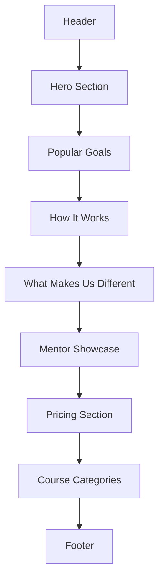

# 🌐 Pathwise — Landing Page Implementation Checklist (MVP Phase 1)
---

## SECTION 1: Initial Setup

---

* [x] Set up layout structure using the existing `Layout` or `AppShell` component
* [x] Integrate shadcn UI (if not already set up)
* [x] Install and configure:

  * [x] `lucide-react` for icons
  * [x] `@tailwindcss/aspect-ratio` for responsive images (using Radix UI AspectRatio component)
  * [x] Fonts (`Inter`) and base typography utilities
* [x] Configure metadata using `next/head` (`title`, `description`, OG tags)

---

## SECTION 2: Header / Navigation

---

* [x] Create a `Header` component

  * [x] **Left:** Logo (Text: "Pathwise")
  * [x] **Center:** Navigation links: `How It Works`, `Learning Paths`, `Mentors`, `Pricing`
  * [x] **Right:** `Sign Up` button using `Button` from shadcn UI
* [x] Make header `sticky` with top shadow on scroll
* [x] Add mobile responsiveness: hamburger menu + mobile nav drawer

---

## SECTION 3: Hero Section

---

* [ ] Create a `HeroSection` component

  * [ ] **H1:** "BUILD YOUR PERSONALIZED LEARNING JOURNEY"
  * [ ] **Subheadline:** "Let AI help you master any skill – one goal at a time."
  * [ ] **Search Bar:**

    * [ ] `Input` component with placeholder: `"What do you want to learn?"`
    * [ ] `Button` labeled `"Get Started"` — navigates to `/start`
  * [ ] **Image**:

    * [ ] Responsive full-width image of diverse learners from Unsplash
    * [ ] Add border using `border` utility
* [ ] Wrap section in a `div` with green background `#D1FAE5`

---

## SECTION 4: Popular Learning Goals Section

---

* [ ] Create `PopularGoalsSection` component

  * [ ] Centered `H2`: "Our Most Pursued Learning Paths"
  * [ ] 3-Column grid layout
* [ ] For each `Card`:

  * [ ] Full-width image (e.g., Unsplash images of people studying/coding)
  * [ ] Short paragraph (1–2 lines)
  * [ ] `Avatar` + instructor name/title
  * [ ] Assign alternating background colors: `#FEF9C3`, `#FCE7F3`, `#D1FAE5`

---

## SECTION 5: How Pathwise Works

---

* [ ] Create `HowItWorksSection` component

  * [ ] 2-column layout:

    * [ ] **Left:** Image of a dashboard UI (mockup or Unsplash)
    * [ ] **Right:**

      * [ ] `H2`: "How Pathwise Helps You Learn Smarter"
      * [ ] Supporting paragraph
      * [ ] Bullet list:

        * [ ] Personalized curriculum
        * [ ] Real-time progress tracking
        * [ ] AI-powered feedback
      * [ ] Each item includes checkmark icon (`CheckCircle` from lucide)

---

## SECTION 6: What Makes Us Different

---

* [ ] Create `UniqueSellingPointsSection` component

  * [ ] Centered `H2`: "What Makes Pathwise Unique"
  * [ ] 3-column grid of features
* [ ] Each card contains:

  * [ ] Icon (e.g., brain, speedometer, map)
  * [ ] `H3` title
  * [ ] Supporting paragraph

---

## SECTION 7: Mentor Showcase Section

---

* [ ] Create `MentorShowcaseSection` component

  * [ ] Centered `H2`: “We Work With Amazing Mentors”
  * [ ] 3-column layout
* [ ] Each `Card` includes:

  * [ ] `Avatar`
  * [ ] `H3`: Mentor name + title
  * [ ] Quote or bio text
  * [ ] Social icons (LinkedIn, Twitter) bottom-right
  * [ ] Alternating background colors: `#F3E8FF`, `#FEF9C3`, `#FCE7F3`

---

## SECTION 8: Pricing Section

---

* [ ] Create `PricingSection` component

  * [ ] Centered `H2`: “Simple, Transparent Pricing”
  * [ ] 3-column layout
* [ ] Each `Card` includes:

  * [ ] `H3` Title: "Starter", "Pro", "Premium"
  * [ ] Price per month
  * [ ] Bullet list of features
  * [ ] `Button`: "Choose Plan"
* [ ] Add hover effect and border for visual emphasis

---

## SECTION 9: Course Categories Section

---

* [ ] Create `CourseCategoriesSection` component

  * [ ] 2-column layout
  * [ ] Clickable category links: "Web Dev", "AI", "Productivity", "Soft Skills", etc.
  * [ ] Each link can optionally lead to `/start` with a prefilled goal

---

## SECTION 10: Footer

---

* [ ] Create `Footer` component

  * [ ] 5-column grid layout

    * **Col 1**: Logo + short mission: “Helping curious minds learn better.”
    * **Col 2**: About, Blog, Careers
    * **Col 3**: Courses, Learning Paths, Mentors
    * **Col 4**: Help Center, Contact, Feedback
    * **Col 5**: Social Media icons
* [ ] Background: light green `#D1FAE5`

---

## SECTION 11: Responsiveness and Accessibility

---

* [ ] Ensure all components are mobile-friendly using Tailwind’s responsive utilities
* [ ] Use `aria` labels where needed (e.g., nav links, input fields)
* [ ] Verify color contrast across text and backgrounds

---

## SECTION 12: Final QA and Review

---

### Functional QA

* [ ] Confirm all CTAs (Search, Choose Plan, Sign Up) link to appropriate pages
* [ ] Validate layout rendering on mobile, tablet, desktop
* [ ] Test sticky nav and footer scroll behavior

### Visual QA

* [ ] Image rendering quality across devices
* [ ] Check visual spacing between sections
* [ ] Validate heading hierarchy and text balance

### Performance & SEO

* [ ] Optimize all image loads (`next/image` if used)
* [ ] Set proper meta tags (`title`, `description`, `og:image`)
* [ ] Lighthouse score ≥90 for performance and accessibility

---

## UI FLOW (Brief)

---